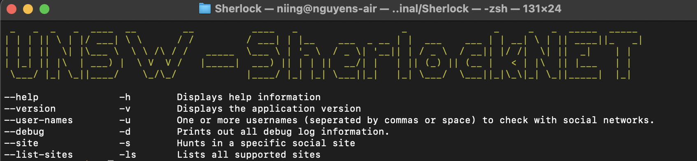

# UNSW - SherlockNET



Inspired by the [Week 5 topic: Tool, OSINT, and Privacy Technology](https://moodle.telt.unsw.edu.au/course/view.php?id=66515&section=11), the [Lab 2 activities](https://moodle.telt.unsw.edu.au/pluginfile.php/8189756/mod_resource/content/2/Lab2v3.pdf), and especially the original [sherlock-project](https://github.com/sherlock-project/sherlock), the UNSW – SherlockNET application aims to use the same OSINT harvesting technique to detect the existence of a specific username of interest across its 358 supported social sites.

This UNSW - SherlockNET encompasses 03 core components and 01 pipelines.

- **An [OSINT](https://osintframework.com/) social network detection engine**. The detection engine takes the username of a particular user of interest as input. It then uses the input to query the user's existence across 358 supported sites.
- **A Command Line Interface (CLI)**. The [CLI](https://www.techtarget.com/searchwindowsserver/definition/command-line-interface-CLI) is the detection engine interface that facilitates the communication between the engine and its users.
- **A Command-Line Parser (CLP)**. The parser is responsible for translating the command and its corresponding flags to instructions that the detection engine can understand.
- **A Make pipeline**. The pipeline is responsible to simplify cross-OS environments and facilitate the build/test/run of the tool.

This project faces the following limitation:

- Only support HEAD & GET query
- Using static text matching to detect failures due to the lack of support HTTP Status Code of some particular sites
- Lack of supporting timeout. The detect engine will scan through all 358 sites
- Cannot tell if `Bob on Twitter` and `Bob on Instagram` is the same person.

## Content

- [Getting Started](#getting-started)
- [Build Approach](#build-approach)
- [Local Environment Variables](#local-environment-variables)
- [Make Steps](#make-steps)

## Getting Started {:#hello}

These instructions will get you a copy of the project up and running on your local machine for development and testing purposes. See deployment for notes on how to deploy the project.

The scripts target a `Mac OS` or `Linux` or `Windows 11 - WSL2` based environment with bash heavily used throughout the source code.

### Prerequisites

In order to develop, test and run locally you'll need to install the following software.

1. [Docker](https://www.docker.com/products/docker-desktop)
2. [Docker Compose](https://docs.docker.com/compose/install/)
3. [Make](https://www.gnu.org/software/make/)

`Docker` and `Docker Compose` are required to run the make steps. Build tools, such as .netcore `sdk` and `runtime`, are dockerized in these containers.

`Make` is required to provide the scaffold runner to construct the make recipies. Further reading [here](https://opensource.com/article/18/8/what-how-makefile)

## Build Approach

The build project uses the [three musketeers](https://3musketeers.io/) pattern to deliver the infrastructure and code into the target environment.

The project also supports the concept of `write one run everywhere pipeline` which means all steps run in any desired CI/CD built-agent and local machine.

## Make Steps

The project folder contains a `Makefile` that holds the definitions of the make recipies listed here.

| Step (make recipies)      | Purpose                                                                                    |
|:--------------------------|:-------------------------------------------------------------------------------------------|
| `make build`              | Build the entire of project. The built-artifact will be output in `.output/dotnet` folder. |
| `make test`               | Build the entire of Test project and execute all existing test(s).The test-artifact will be output in `.output/tests` folder. |
| `make run ARGS="<flags>"` | Run the OSINT detection tool by launching the `built-artifact` in the local Docker desktop. |

## How to run on local
1. Navigate yourself to the `Sherlock` folder
```
cd Sherlock
```
2. Build project
```
make build
```
3. Test project
```
make test
```
4. Run the project
```
# Display help information
make run ARGS="-h" OR make run ARGS="--help"

# List all supported sites
make run ARGS="-ls" OR make run ARGS="--list-sites"

# Hunt a particular user on a specific site
make run ARGS="-u tuktuk --site ebay.com"

# Hunt a particular user on a specific site with printed debug information
make run ARGS="-u tuktuk --site ebay.com --debug"

# Hunt a particular user across 358 supported sites
make run ARGS="-u tuktuk"